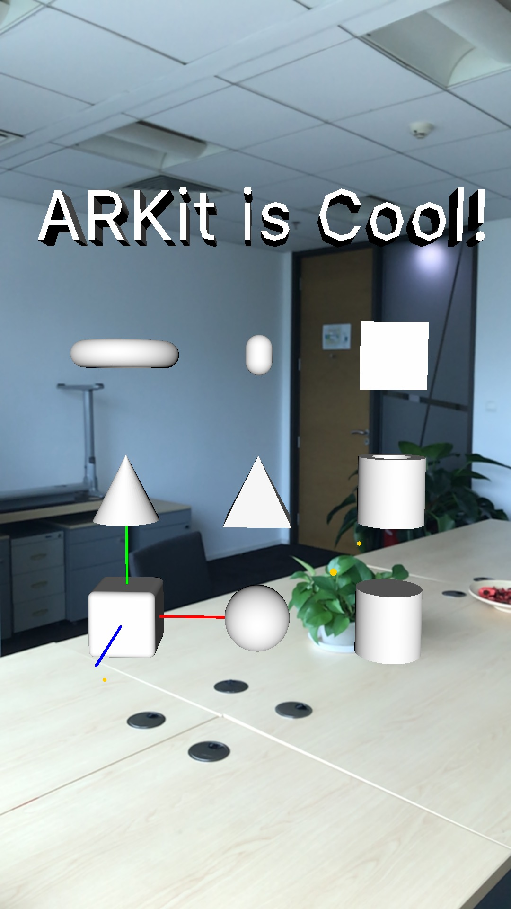

# react-native-arkit

[](https://www.npmjs.com/package/react-native-arkit)
[](https://www.npmjs.com/package/react-native-arkit)

React Native binding for iOS ARKit.

**Tutorial**: [How to make an ARKit app in 5 minutes using React Native](https://medium.com/@HippoAR/how-to-make-your-own-arkit-app-in-5-minutes-using-react-native-9d7ce109a4c2)

**Sample Project**: https://github.com/HippoAR/ReactNativeARKit

**Note**: ARKit is only supported by devices with A9 or later processors (iPhone 6s/7/SE/8/X, iPad 2017/Pro) on iOS 11. You also need Xcode 9 to build the project.

There is a Slack group that anyone can join for help / support / general questions.

[**Join Slack**](https://join.slack.com/t/react-native-ar/shared_invite/enQtMjUzMzg3MjM0MTQ5LWU3Nzg2YjI4MGRjMTM1ZDBlNmIwYTE4YmM0M2U0NmY2YjBiYzQ4YzlkODExMTA0NDkwMzFhYWY4ZDE2M2Q4NGY)

## Getting started

`$ yarn add react-native-arkit`

(npm does not work properly at the moment)

### Mostly automatic installation

`$ react-native link react-native-arkit`

! Currently automatic installation does not work as PocketSVG is missing. Follow the manual installation

### Manual installation


#### iOS

1. In XCode, in the project navigator, right click `Libraries` ➜ `Add Files to [your project's name]`
2. Go to `node_modules` ➜ add `react-native-arkit/RCTARKit.xcodeproj` and `_PocketSVG/_PocketSVG.xcodeproj`
3. In XCode, in the project navigator, select your project. Add `libRCTARKit.a` `and PocketSVG.framework` to your project's `Build Phases` ➜ `Link Binary With Libraries`
4. In Tab `General` ➜ `Embedded Binaries` ➜ `+` ➜ Add `PocketSVG.framework ios`
5. Run your project (`Cmd+R`)<


## Usage

A simple sample React Native ARKit App

```javascript
// index.ios.js

import React, { Component } from 'react';
import { AppRegistry, View } from 'react-native';
import { ARKit } from 'react-native-arkit';

export default class ReactNativeARKit extends Component {
  render() {
    return (
      <View style={{ flex: 1 }}>
        <ARKit
          style={{ flex: 1 }}
          debug
          planeDetection
          lightEstimation
          onPlaneDetected={console.log} // event listener for plane detection
          onPlaneUpdate={console.log} // event listener for plane update
        >
          <ARKit.Box
            position={{ x: 0, y: 0, z: 0 }}
            shape={{ width: 0.1, height: 0.1, length: 0.1, chamfer: 0.01 }}
          />
          <ARKit.Sphere
            position={{ x: 0.2, y: 0, z: 0 }}
            shape={{ radius: 0.05 }}
          />
          <ARKit.Cylinder
            position={{ x: 0.4, y: 0, z: 0 }}
            shape={{ radius: 0.05, height: 0.1 }}
          />
          <ARKit.Cone
            position={{ x: 0, y: 0.2, z: 0 }}
            shape={{ topR: 0, bottomR: 0.05, height: 0.1 }}
          />
          <ARKit.Pyramid
            position={{ x: 0.2, y: 0.15, z: 0 }}
            shape={{ width: 0.1, height: 0.1, length: 0.1 }}
          />
          <ARKit.Tube
            position={{ x: 0.4, y: 0.2, z: 0 }}
            shape={{ innerR: 0.03, outerR: 0.05, height: 0.1 }}
          />
          <ARKit.Torus
            position={{ x: 0, y: 0.4, z: 0 }}
            shape={{ ringR: 0.06, pipeR: 0.02 }}
          />
          <ARKit.Capsule
            position={{ x: 0.2, y: 0.4, z: 0 }}
            shape={{ capR: 0.02, height: 0.06 }}
          />
          <ARKit.Plane
            position={{ x: 0.4, y: 0.4, z: 0 }}
            shape={{ width: 0.1, height: 0.1 }}
          />
          <ARKit.Text
            text="ARKit is Cool!"
            position={{ x: 0.2, y: 0.6, z: 0 }}
            font={{ size: 0.15, depth: 0.05 }}
          />
          <ARKit.Model
            position={{ x: -0.2, y: 0, z: 0, frame: 'local' }}
            scale={0.01}
            model={{
              file: 'art.scnassets/ship.scn', // make sure you have the model file in the ios project
            }}
          />
          <ARKit.Shape
            position={{ x: -1, y: 0, z: 0 }}
            eulerAngles={{
              x: Math.PI,
            }}
            scale={0.01}
            shape={{
              // specify shape by svg! See https://github.com/HippoAR/react-native-arkit/pull/89 for details
              pathSvg: `
              <svg xmlns="http://www.w3.org/2000/svg" viewBox="0 0 100 100">
                <path d="M50,30c9-22 42-24 48,0c5,40-40,40-48,65c-8-25-54-25-48-65c 6-24 39-22 48,0 z" fill="#F00" stroke="#000"/>
              </svg>`,
              pathFlatness: 0.1,
              // it's also possible to specify a chamfer profile:
              chamferRadius: 5,
              chamferProfilePathSvg: `
                <path d="M.6 94.4c.7-7 0-13 6-18.5 1.6-1.4 5.3 1 6-.8l9.6 2.3C25 70.8 20.2 63 21 56c0-1.3 2.3-1 3.5-.7 7.6 1.4 7 15.6 14.7 13.2 1-.2 1.7-1 2-2 2-5-11.3-28.8-3-30.3 2.3-.4 5.7 1.8 6.7 0l8.4 6.5c.3-.4-8-17.3-2.4-21.6 7-5.4 14 5.3 17.7 7.8 1 .8 3 2 3.8 1 6.3-10-6-8.5-3.2-19 2-8.2 18.2-2.3 20.3-3 2.4-.6 1.7-5.6 4.2-6.4"/>
              `,
              extrusion: 10,
            }}
          />  
        </ARKit>
      </View>
    );
  }
}

AppRegistry.registerComponent('ReactNativeARKit', () => ReactNativeARKit);

```



### Components

#### `<ARKit />`

##### Props

| Prop | Type | Default | Note |
|---|---|---|---|
| `debug` | `Boolean` | `false` | Debug mode will show the 3D axis and feature points detected.
| `planeDetection` | `Boolean` | `false` | ARKit plane detection.
| `lightEstimation` | `Boolean` | `false` | ARKit light estimation.
| `worldAlignment` | `Enumeration` <br /> One of: `ARKit.ARWorldAlignment.Gravity`, `ARKit.ARWorldAlignment.GravityAndHeading`, `ARKit.ARWorldAlignment.Camera` (documentation [here](https://developer.apple.com/documentation/arkit/arworldalignment)) | `ARKit.ARWorldAlignment.Gravity` | **ARWorldAlignmentGravity** <br /> The coordinate system's y-axis is parallel to gravity, and its origin is the initial position of the device. **ARWorldAlignmentGravityAndHeading** <br /> The coordinate system's y-axis is parallel to gravity, its x- and z-axes are oriented to compass heading, and its origin is the initial position of the device. **ARWorldAlignmentCamera** <br /> The scene coordinate system is locked to match the orientation of the camera.|

##### Events

| Event Name | Returns | Notes
|---|---|---|
| `onPlaneDetected` | `{ id, center, extent }` | When a plane is first detected.
| `onPlaneUpdate` | `{ id, center, extent }` | When a detected plane is updated

##### Static methods

| Method Name | Arguments |  Notes
|---|---|---|
| `snapshot` |  |  | Take a screenshot (will save to Photo Library) |
| `snapshotCamera` |  | Take a screenshot without 3d models (will save to Photo Library) |
| `getCameraPosition` |  | Get the current position of the `ARCamera` |
| `focusScene` |  | Sets the scene's position/rotation to where it was when first rendered (but now relative to your device's current position/rotation) |
| `hitTestPlanes` | point, type  |  check if a plane has ben hit by point (`{x,y}`) with detection type (any of `ARKit.ARHitTestResultType`). See https://developer.apple.com/documentation/arkit/arhittestresulttype?language=objc for further information |
| `hitTestSceneObjects` | point |  check if a scene object has ben hit by point (`{x,y}`) |


#### [`<ARKit.Box />`](https://developer.apple.com/documentation/scenekit/scnbox)

##### Props

| Prop | Type |
|---|---|
| `position` | `{ x, y, z }` |
| `eulerAngles` | `{ x, y, z }` |
| `shape` | `{ width, height, length, chamfer }` |
| `material` | `{ diffuse, metalness, roughness, lightingModel }` |

#### [`<ARKit.Sphere />`](https://developer.apple.com/documentation/scenekit/scnsphere)

##### Props

| Prop | Type |
|---|---|
| `position` | `{ x, y, z }` |
| `eulerAngles` | `{ x, y, z }` |
| `shape` | `{ radius }` |
| `material` | `{ diffuse, metalness, roughness, lightingModel }` |

#### [`<ARKit.Cylinder />`](https://developer.apple.com/documentation/scenekit/scncylinder)

##### Props

| Prop | Type |
|---|---|
| `position` | `{ x, y, z }` |
| `eulerAngles` | `{ x, y, z }` |
| `shape` | `{ radius, height }` |
| `material` | `{ diffuse, metalness, roughness, lightingModel }` |

#### [`<ARKit.Cone />`](https://developer.apple.com/documentation/scenekit/scncone)

##### Props

| Prop | Type |
|---|---|
| `position` | `{ x, y, z }` |
| `eulerAngles` | `{ x, y, z }` |
| `shape` | `{ topR, bottomR, height }` |
| `material` | `{ diffuse, metalness, roughness, lightingModel }` |

#### [`<ARKit.Pyramid />`](https://developer.apple.com/documentation/scenekit/scnpyramid)

##### Props

| Prop | Type |
|---|---|
| `position` | `{ x, y, z }` |
| `eulerAngles` | `{ x, y, z }` |
| `shape` | `{ width, height, length }` |
| `material` | `{ diffuse, metalness, roughness, lightingModel }` |

#### [`<ARKit.Tube />`](https://developer.apple.com/documentation/scenekit/scntube)

##### Props

| Prop | Type |
|---|---|
| `position` | `{ x, y, z }` |
| `eulerAngles` | `{ x, y, z }` |
| `shape` | `{ innerR, outerR, height }` |
| `material` | `{ diffuse, metalness, roughness, lightingModel }` |

#### [`<ARKit.Torus />`](https://developer.apple.com/documentation/scenekit/scntorus)

##### Props

| Prop | Type |
|---|---|
| `position` | `{ x, y, z }` |
| `eulerAngles` | `{ x, y, z }` |
| `shape` | `{ ringR, pipeR }` |
| `material` | `{ diffuse, metalness, roughness, lightingModel }` |

#### [`<ARKit.Capsule />`](https://developer.apple.com/documentation/scenekit/scncapsule)

##### Props

| Prop | Type |
|---|---|
| `position` | `{ x, y, z }` |
| `eulerAngles` | `{ x, y, z }` |
| `shape` | `{ capR, height }` |
| `material` | `{ diffuse, metalness, roughness, lightingModel }` |

#### [`<ARKit.Plane />`](https://developer.apple.com/documentation/scenekit/scnplane)

##### Props

| Prop | Type |
|---|---|
| `position` | `{ x, y, z }` |
| `eulerAngles` | `{ x, y, z }` |
| `shape` | `{ width, height }` |
| `material` | `{ diffuse, metalness, roughness, lightingModel }` |

#### [`<ARKit.Text />`](https://developer.apple.com/documentation/scenekit/scntext)

##### Props

| Prop | Type |
|---|---|
| `text` | `String` |
| `position` | `{ x, y, z }` |
| `eulerAngles` | `{ x, y, z }` |
| `font` | `{ name, size, depth, chamfer }` |
| `material` | `{ diffuse, metalness, roughness, lightingModel }` |


#### `<ARKit.Model />`

SceneKit only supports `.scn` and `.dae` formats.

##### Props

| Prop | Type |
|---|---|
| `position` | `{ x, y, z }` |
| `eulerAngles` | `{ x, y, z }` |
| `model` | `{ file, node, scale, alpha }` |

#### `<ARKit.Shape />`

Creates a extruded shape by an svg path.
See https://github.com/HippoAR/react-native-arkit/pull/89 for details

##### Props

| Prop | Type |
|---|---|
| `position` | `{ x, y, z }` |
| `eulerAngles` | `{ x, y, z }` |
| `shape` | `{ pathSvg, extrusion, pathFlatness, chamferRadius, chamferProfilePathSvg, chamferProfilePathFlatness }` |


### HOCs (higher order components)

#### withProjectedPosition()

this hoc allows you to create 3D components where the position is always relative to the same point on the screen/camera, but sticks to a plane or object.

Think about a 3D cursor that can be moved across your table or a 3D cursor on a wall.

You can use the hoc like this:

```
const Cursor3D = withProjectedPosition()(({positionProjected, projectionResult}) => {
  if(!projectionResult) {
    // nothing has been hit, don't render it
    return null;
  }
  return (
    <ARKit.Sphere
      position={positionProjected}
      transition={{duration: 0.1}}
      shape={{
        radius: 0.1
        }}
    />
  )
})

```

It's recommended that you specify a transition duration (0.1s works nice), as the position gets updated rapidly, but slightly throttled.

Now you can use your 3D cursor like this:

##### Attach to a given detected horizontal plane

Given you have detected a plane with onPlaneDetected, you can make the cursor stick to that plane:

```
<Cursor3D projectPosition={{
  x: windowWidth / 2,
  y: windowHeight / 2,
  plane: "my-planeId"
  }}
/>

```

If you don't have the id, but want to place the cursor on a certain plane (e.g. the first or last one), pass a function for plane. This function will get all hit-results and you can return the one you need:

```
<Cursor3D projectPosition={{
  x: windowWidth / 2,
  y: windowHeight / 2,
  plane: (results) => results.length > 0 ? results[0] : null
  }}
/>

```

You can also add a property `onProjectedPosition` to your cursor which will be called with the hit result on every frame

It uses https://developer.apple.com/documentation/arkit/arframe/2875718-hittest with some default options. Please file an issue or send a PR if you need more control over the options here!

##### Attach to a given 3D object

You can attach the cursor on a 3D object, e.g. a non-horizontal-plane or similar:

Given there is some 3D object on your scene with `id="my-nodeId"`

```
<Cursor3D projectPosition={{
  x: windowWidth / 2,
  y: windowHeight / 2,
  node: "my-nodeId"
  }}
/>
```

Like with planes, you can select the node with a function.

E.gl you have several "walls" with ids "wall_1", "wall_2", etc.

```
<Cursor3D projectPosition={{
  x: windowWidth / 2,
  y: windowHeight / 2,
  node: results => results.find(r => r.id.startsWith('wall_')),
  }}
/>
```


It uses https://developer.apple.com/documentation/scenekit/scnscenerenderer/1522929-hittest with some default options. Please file an issue or send a PR if you need more control over the options here!


## Contributing

If you find a bug or would like to request a new feature, just [open an issue](https://github.com/HippoAR/react-native-arkit/issues/new). Your contributions are always welcome! Submit a pull request and see [`CONTRIBUTING.md`](CONTRIBUTING.md) for guidelines.
